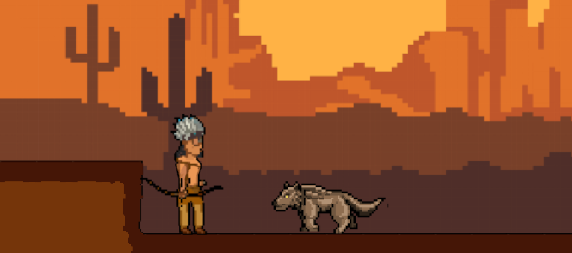

# Aboriginal_Survivor

## Overview
Aboriginal_Survivor is a Java-based jump 'n run video game. This project was developed as part of the "Media Programming" course in the "Media Technology" program at the University of Applied Sciences RheinMain.

## Game Description
Aboriginal_Survivor is an entertaining jump 'n run game where the player take on the role of an Aboriginal hero and must overcome dangerous challenges in a fascinating world. 

## Gameplay Instructions
1. **Controls:**
   - Use the "W," "A," "S," and "D" keys to move.
   - Press the spacebar to jump.
   - Click the left mouse button to fire your bow.

2. **Collecting Stars:**
   - Stars are scattered throughout the level and can be collected.
   - Collecting a star grants temporary invulnerability.

3. **Objective:**
   - Overcome all obstacles and enemies to reach the goal.
   - Collect stars to become briefly invulnerable.
   - Complete the level within 30 seconds.

## Installation
To play the game, follow these steps:

1. Clone the repository 
2. Open the project in a Java development environment (e.g., Eclipse or IntelliJ IDEA).
3. Compile and run

## Credits
Special thanks to [KaarinGamings](https://github.com/KaarinGaming) for his [PlatformerTutorial](https://github.com/KaarinGaming/PlatformerTutorial), which served as the primary inspiration and provided the main structure for this project.

## License
This project is licensed under the [MIT License](LICENSE). For more information, please refer to the license file.
